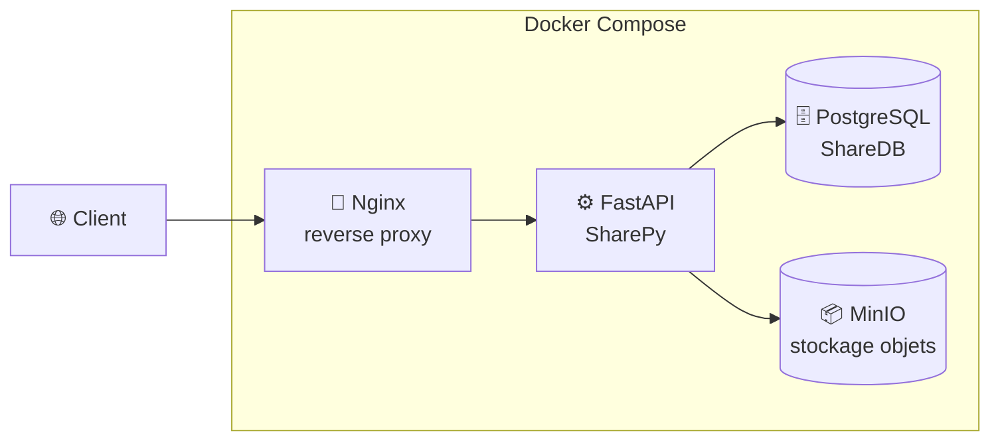

# 🔓→🔒 Misconfig Mayhem — Lab OWASP A02:2025 (Security Misconfiguration)


> Application web **« SharePy »** (mini-plateforme de partage de fichiers type Dropbox) **volontairement vulnérable**, utilisée pour **identifier, exploiter puis corriger** trois mauvaises configurations critiques — en suivant la démarche **Red Team → Blue Team → Validation**.

**Projet académique — ENSA Fès (filière GDNC2, 2025/2026)** · Encadré par **Pr Mohammed AIRAJ**
Référence : **OWASP Top 10 — A02:2025 Security Misconfiguration** (A05 en 2021, monté à la 2ᵉ place en 2025).

---

## 🎯 Objectif
Démontrer, de bout en bout, le cycle de vie d'une faille de **misconfiguration** : déployer une application mal configurée, **exploiter** les failles comme un attaquant (Red Team), puis les **corriger et durcir** la configuration (Blue Team), et enfin **valider** les correctifs avec des outils professionnels.

## 🧩 Architecture

Dans la version **sécurisée**, seul **Nginx (port 80)** est exposé ; la base de données, MinIO et l'app ne sont plus accessibles depuis l'extérieur.

## 🔥 Les 3 misconfigurations étudiées

| # | Vulnérabilité (version mal configurée) | Impact | Correction (durcissement) |
|---|---|---|---|
| **M1** | **Mots de passe faibles / en clair** (`admin123`, `password123`) dans `.env` et en dur dans le code | Critique — accès BDD, compromission des données | Mots de passe forts via **variables d'environnement**, `.env` non versionné, template `.env.example` |
| **M2** | **Mode debug activé** : `debug=True` (stack traces complètes), logs `DEBUG`, endpoint `/debug/info` exposant des infos système | Critique — *information disclosure* (structure du code, chemins système) | `debug=False`, logs en `INFO`, endpoint `/debug/info` **supprimé** |
| **M3** | **Directory listing & exposition excessive** : `autoindex on` (liste/téléchargement des fichiers d'autres utilisateurs), `server_tokens on`, services BDD/MinIO/app exposés, **aucun header de sécurité** | Élevé — violation de confidentialité, surface d'attaque élargie | `autoindex off`, `server_tokens off`, **headers de sécurité** (X-Frame-Options, X-Content-Type-Options, X-XSS-Protection, Referrer-Policy, CSP), **seul Nginx exposé** |

## 🧪 Méthodologie
1. **Red Team (attaque)** — identification et **exploitation réussie** des 3 failles, documentation des vecteurs d'attaque et de leur impact.
2. **Blue Team (défense)** — analyse des causes racines, implémentation des correctifs, durcissement de la configuration.
3. **Validation** — script de vérification automatique + scans comparatifs avant/après.

## ✅ Résultats de validation
- **`check_security.py` : 4/4 tests réussis** (M1, M2, M3 corrigées et vérifiées via HTTP).
- **Nmap** — forte réduction de l'exposition : les ports de la BDD, de MinIO et de l'app ne sont plus accessibles depuis l'hôte.
- **Nikto** — **~85 % d'alertes en moins**, et présence confirmée des headers de sécurité.
- Les scans bruts sont dans [`scans/`](scans/) (versions *vulnerable* et *secure*).

## ⚙️ Utilisation
```bash
git clone https://github.com/Dohaa-Em/misconfig-mayhem.git
cd misconfig-mayhem

# --- Version SÉCURISÉE (par défaut) ---
cp app/.env.example app/.env        # puis renseigner des valeurs FORTES
docker compose up -d --build
#   → http://localhost  (seul Nginx est exposé)

# --- Vérifier les corrections ---
python3 check_security.py           # attendu : 4/4 tests réussis

# --- Version VULNÉRABLE (pour reproduire les failles) ---
cp app/.env.vulnerable app/.env
cp app/main.py.vulnerable app/main.py
cp nginx/nginx.conf.vulnerable nginx/nginx.conf
docker compose -f docker-compose.yml.vulnerable up -d --build
```

## 📁 Structure du dépôt
```
misconfig-mayhem/
├── app/                 # Application FastAPI (main.py sécurisé + main.py.vulnerable)
│   ├── .env.example     # Template de config (sans secrets)
│   └── .env.vulnerable  # Config faible, pour la démo des failles
├── nginx/               # Reverse proxy (config sécurisée + .vulnerable)
├── scans/               # Scans Nmap & Nikto (avant / après)
├── docker-compose.yml   # Stack sécurisée (+ .vulnerable)
├── check_security.py    # Script de validation automatique (M1/M2/M3)
└── docs/                # Rapport complet (PDF)
```

## 🧠 Compétences démontrées
Sécurité applicative (**OWASP A02:2025**) · durcissement (hardening) · **DevSecOps** (Docker, Nginx, isolation réseau) · headers de sécurité · tests d'intrusion (Nmap, Nikto) · automatisation de la vérification de conformité.

## ⚠️ Avertissement
Ce dépôt contient volontairement du code et des configurations **vulnérables** (par conception, à des fins pédagogiques). Les identifiants présents sont **factices**. À exécuter **uniquement en local / VM isolée**, **jamais exposé sur Internet**.

## 📄 Rapport complet
Analyse détaillée (exploitation + correction + captures) : [`docs/RAPPORT_Misconfig_Mayhem.pdf`](docs/RAPPORT_Misconfig_Mayhem.pdf).

## 👤 Auteur
**Doha EL MERABET** — Élève-ingénieure Cybersécurité (ENSA Fès)
[LinkedIn](https://linkedin.com/in/doha-el-merabet) · [GitHub](https://github.com/Dohaa-Em)

## 📄 Licence
Distribué sous licence MIT — voir [LICENSE](LICENSE).
